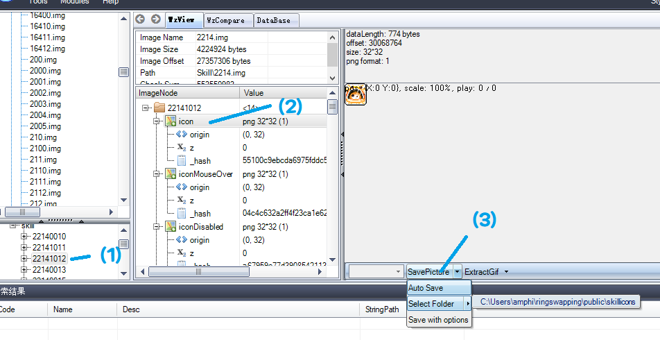

# MSEA Ring Swapping bug report compilation

## Contributing

The site is set up to draw all of the skill data from `src/skillData.ts`. Adding skills to report errors is as simple as adding a new entry to `const skillDist`, and adding the skill icon (pulled from wzcomparer) to `src/skillicons` with the filename `{Skill ID}.icon.png`.

Note: to extract the icon with this name format, when double-clicking the image node in WzComparer be sure to click the skill ID number (not any of the sub-nodes, and not the upper-level `{Job ID}.img` node). Then click on `icon` and click Save Image on the right.

When extracting many icons at once, for convenience you can also toggle Auto Save, which requires you to specify a folder for it to auto save to. Without this, you will have to choose a folder to save the image to every time. It's not essential to do so, but it is a nice convenience.

## Recording videos: Guidelines

It is recommended to use ShareX to easily record videos at high quality, since it supports keyboard shortcuts to start/stop recording.

When recording, take note of the following:

- Try to isolate the source of damage. E.g. if you're trying to show that Eunwol's Fox Spirits causes the issue, have a good 2-3 seconds where a Fox Spirit is bouncing and no other attack is hitting the enemy so that it's clear that the issue is being caused by Fox Spirits.
- If recording the bugged (MSEA) state, make sure that the chatbox doesn't already have the message so that it's clearer that the erroneous message is popping out.
- Make sure that you record at least one attempt to change equips while your character is at a resting (non-combat) state, and that the message pops up when you do so.
- When recording the non-bugged (KMS) state, make sure to demonstrate that it is possible to change equips as soon as the character is in a resting state; don't wait too long after. The important thing here is that we want to capture the convenience of KMS where we can ring-swap ASAP, and that this error in MSEA is inhibiting that.
- For cleanliness of presentation, avoid changing equips in combat state (producing the blue window in the middle of the screen), which will muddle up the bug report.

If using ShareX, record as .mp4 and upload to Discord (just uploading it in any server in Discord and then sharing the `cdn.discordapp.com` link is fine). Do not record as .gif as it will increase file size dramatically, which will affect the loading of the page.
